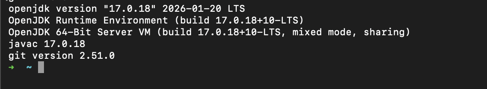

# 여행 기록 관리 프로그램 (Travel CRUD)

GitHub Repository: https://github.com/Evvvaaaaan/webService_2026

## ① 프로젝트 소개

### 프로젝트 주제
Book 관리 프로그램 대신 **여행 기록 관리 프로그램**을 주제로 선정했습니다.
다녀온 여행지, 날짜, 비용, 만족도(평점), 메모를 기록하고 관리하는 콘솔 프로그램입니다.

### 관리하는 데이터 (Entity: Travel)
| 필드 | 타입 | 설명 |
|---|---|---|
| id | int | 여행 기록 고유 번호 (자동 부여) |
| destination | String | 여행지 |
| travelDate | LocalDate | 여행 날짜 |
| cost | int | 여행 비용 |
| rating | double | 만족도 평점 (0~5) |
| memo | String | 메모 |

### 주요 CRUD 기능
- **Create**: 여행 정보 등록 (`여행지 / 날짜 / 비용 / 평점 / 메모` 입력)
- **Read**: 전체 여행 목록 조회, ID로 단건 조회
- **Update**: ID로 여행 정보 조회 후 수정
- **Delete**: ID로 여행 정보 삭제

데이터는 `ArrayList`를 이용해 메모리에만 저장하며, 프로그램 종료 시 사라집니다.

### 프로젝트 구조
Layered Architecture(Main → View → Service → Repository → MemoryRepository)를 적용했습니다.

```
src/main/java
└── com.example.travel
    ├── Main.java
    ├── model
    │   └── Travel.java
    ├── repository
    │   ├── TravelRepository.java          (interface)
    │   └── TravelMemoryRepository.java    (ArrayList 기반 구현체)
    ├── service
    │   └── TravelService.java
    └── view
        └── ConsoleView.java
```

- `TravelRepository`는 인터페이스로 정의하고, `TravelMemoryRepository`에서 `ArrayList<Travel>`을 이용해 구현했습니다.
- `TravelService`는 Repository를 주입받아 비즈니스 로직(입력값 검증 등)을 담당합니다.
- `ConsoleView`는 사용자 입력을 받아 메뉴를 출력하고 Service를 호출합니다.

## ② 이번 과제 키워드

Java / ArrayList / CRUD / Class / Object
Interface / Layered Architecture / Repository
Service / Dependency Injection / Git / GitHub

## ③ Weekly Report

### 이번 주에 배운 내용
- Java 개발환경(JDK, IntelliJ, Git) 점검 방법을 익혔습니다.
- `ArrayList`를 이용해 메모리 기반으로 데이터를 CRUD 하는 방법을 실습했습니다.
- Main에 모든 로직을 넣지 않고 View / Service / Repository로 계층을 분리하는 **Layered Architecture**를 적용해봤습니다.
- Repository를 **Interface**로 선언하고 `MemoryRepository`가 이를 구현하도록 하여, 나중에 저장 방식(DB 등)이 바뀌어도 Service/View 코드는 그대로 유지할 수 있는 구조를 경험했습니다.

### 구현하면서 어려웠던 부분
- 계층을 나누다 보니 각 클래스가 어떤 책임을 가져야 하는지 헷갈렸습니다. (예: 입력값 검증을 View에서 할지 Service에서 할지)
- Repository를 인터페이스와 구현체로 분리하는 이유와 이점이 처음에는 와닿지 않았습니다.

### 문제를 해결한 방법
- 검증 로직은 Service 계층에 두어, View는 입력만 받고 Service는 "규칙"을 담당하도록 정리했습니다.
- Repository를 인터페이스로 분리하면 Service는 구체 구현(`TravelMemoryRepository`)이 아니라 인터페이스(`TravelRepository`)에만 의존하게 되어, 추후 저장소를 교체해도 Service 코드를 수정하지 않아도 된다는 점을 이해했습니다.

### 아직 이해가 부족하거나 궁금한 내용
- 지금은 Repository 구현체가 하나(Memory)뿐인데, 실제로 DB 기반 Repository를 추가했을 때 Service/View 코드를 얼마나 수정하지 않고 그대로 쓸 수 있는지 직접 경험해보고 싶습니다.
- 계층 간 의존성 주입을 지금은 Main에서 직접 `new`로 연결했는데, 프로젝트가 커지면 이 부분을 어떻게 관리하는지(DI 프레임워크 등) 궁금합니다.

### 수업 또는 과제에 대한 건의사항
- Layered Architecture 개념을 그림/다이어그램으로 먼저 보여주신 뒤 실습하면 계층 간 책임 분리를 더 빨리 이해할 수 있을 것 같습니다.

---

## 개발환경 확인




## CRUD 프로그램 실행 화면

> TODO: 프로그램 실행 후 등록/조회/수정/삭제 콘솔 화면 스크린샷 첨부
